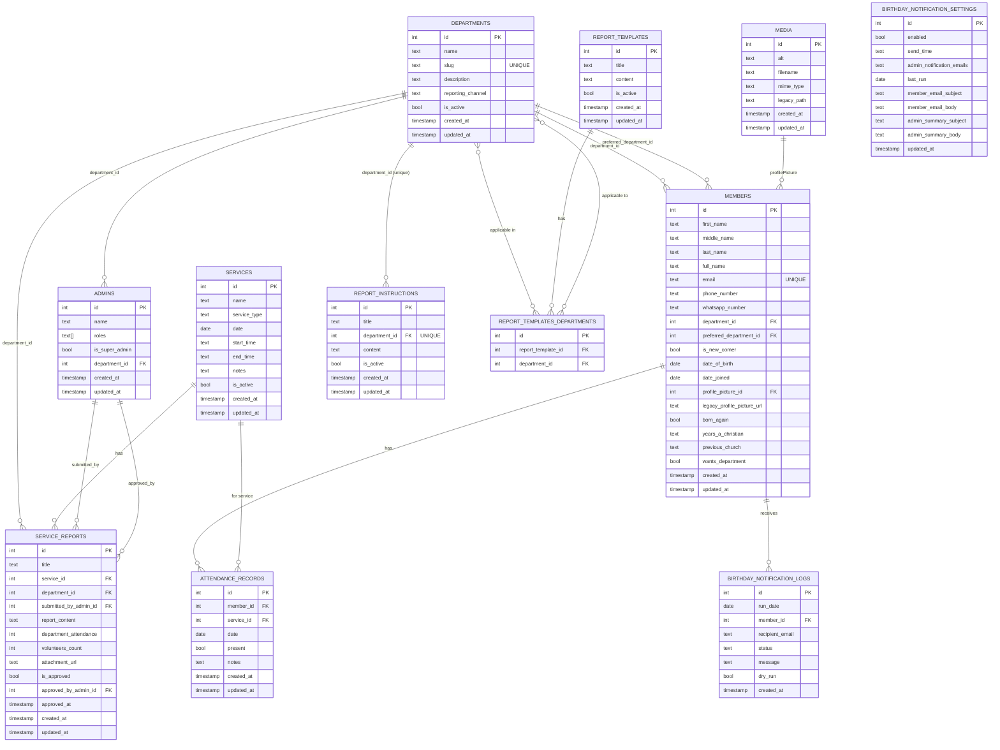

# Thenestchurch Data Model ERD

The models below describe the Supabase/PostgreSQL relational structure used by the application.

## Notes

- `report-instructions.department_id` is enforced unique at the field level (`unique: true`), so each department can have at most one active instruction row.
- `service-reports` has an application-level uniqueness rule preventing duplicate records for the same `(service, department)` pair.
- `media` is used as the upload target for `members.profilePicture`.
- `birthday-notification-settings` is a singleton configuration row, modeled as its own entity for documentation.
